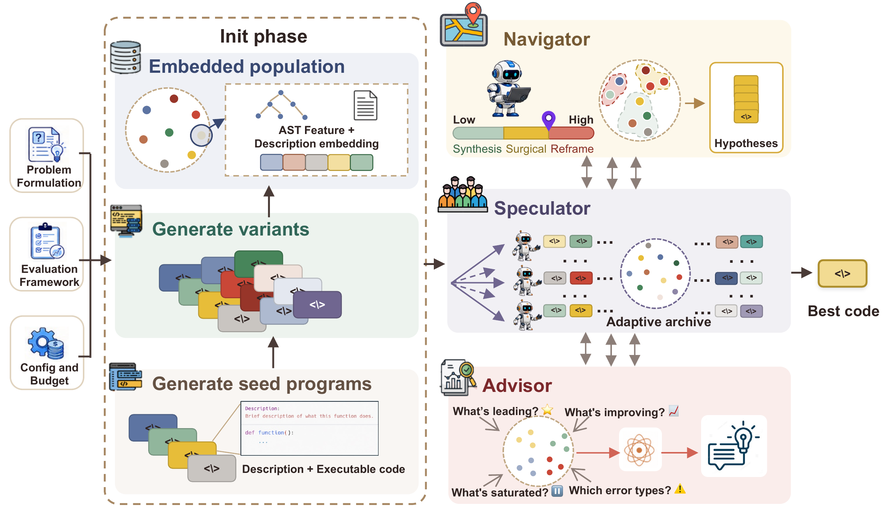
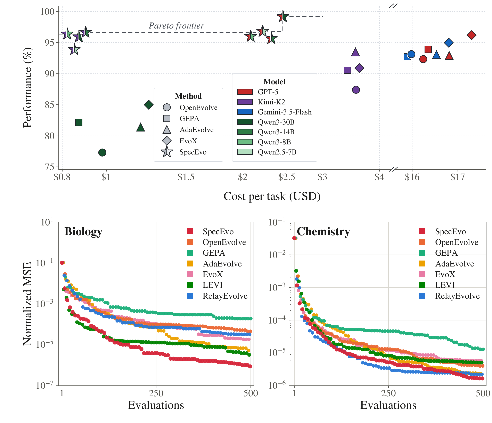

# SpecEvo: Speculative Evolution with Large Language Models for Cost-Efficient Scientific Discovery

[Ha Minh Hieu](https://openreview.net/profile?id=~Ha_Minh_Hieu1), [Tongyao Zhu](https://openreview.net/profile?id=~TONGYAO_ZHU1), [Do Xuan Long](https://openreview.net/profile?id=~Do_Xuan_Long1), and [Min-Yen Kan](https://openreview.net/profile?id=~Min-Yen_Kan1)

[](docs/SETUP.md)
[](LICENSE)

[Quickstart](#quickstart) · [Results](#main-results) · [Reproduction](docs/REPRODUCING.md) · [Documentation](#documentation)

**Explore with lightweight models; consolidate with frontier reasoning.**
SpecEvo coordinates LLMs for scientific discovery: parallel **Speculators** propose
programs, an **Advisor** turns successes and failures into reusable guidance, and
a frontier **Navigator** intervenes at sparse checkpoints. Model coordination
adapts as the search progresses.

[](assets/figures/main.pdf)

## Main results

The paper evaluates **176 tasks across four domains**. A compact view of the
findings is below; experimental settings and qualifications are in
[Results and artifacts](docs/RESULTS.md).

| Domain | Tasks | Main finding |
|:--|--:|:--|
| Mathematical discovery + systems optimization | 11 | Competitive with frontier-model baselines, with **up to 80% lower API cost** in the reported comparisons. |
| Combinatorial optimization (CO-Bench) | 36 | **3.8% higher mean normalized score** than the strongest baseline; best or tied-best on 20 tasks. |
| Equation discovery (LSR-Synth) | 129 | Lowest NMSE in all eight domain/split settings among the six main evolutionary baselines at 500 evaluations. |



## Quickstart

Use Python 3.11 and run these commands from the repository root:

```bash
git clone https://github.com/langkhachhoha/SpecEvo.git
cd SpecEvo
python3.11 -m venv .venv
source .venv/bin/activate
python -m pip install -e ".[dev]"
```

Check the installation without an API key:

```bash
python -m pytest -q
python scripts/run_specevo.py --help
```

For a small live run, copy `.env.example` to `.env` and set `OPENAI_API_KEY`
to your OpenRouter key. This example uses a lightweight model for both roles
and writes the best program and run summary to `outputs/smoke/`:

```bash
cp .env.example .env
# Edit .env before running the command below.
python scripts/run_specevo.py \
  --task-dir tasks/smoke_demo \
  --speculator-model openrouter/openai/gpt-4o-mini \
  --navigator-model openrouter/openai/gpt-4o-mini \
  --evals 12 --dollars 0.10 --seconds 180 \
  --n-diverse-seeds 2 --n-variants-per-seed 2 \
  --navigator-interval 5 --advisor-interval 5 \
  --workers 2 --eval-processes 2 --eval-timeout 30 \
  --output-dir outputs/smoke
```

Live runs use paid API calls and execute generated Python locally. The dollar
budget is a stopping threshold; requests already in flight may exceed it.
For benchmark dependencies, datasets and `uv` installation, see [Setup](docs/SETUP.md).

## Reproduce an experiment

After [installing evaluator dependencies and fetching data](docs/SETUP.md):

```bash
python scripts/run_specevo.py \
  --task-dir tasks/circle_packing \
  --evals 500 --dollars 10 --seconds 10800 \
  --output-dir outputs/circle_packing
```

This example combines three stopping conditions. The paper compares separate
budget regimes; see [Reproduction](docs/REPRODUCING.md) for suite launchers,
model choices, seeds and result aggregation.

## What is included

```text
specevo/             SpecEvo search, archive, model clients, and LEVI
specevo_baselines/   Baseline methods and shared evaluation framework
tasks/              Task adapters for SpecEvo and LEVI
benchmarks/         Benchmark evaluators, baseline configs, and data helpers
scripts/            Run, setup, reproduction, and analysis commands
result/             Six example discovered programs
docs/               Setup, run options, baselines, benchmarks, and reproduction
assets/figures/      Paper figures displayed in this repository
tests/              Offline unit and mocked end-to-end tests
```

The example programs are a small selection, not the complete experiment logs.
See [Results and artifacts](docs/RESULTS.md) for their scope.

## Documentation

| If you want to… | Start here |
|:--|:--|
| Install dependencies or download data | [Setup](docs/SETUP.md) |
| Change models, budgets or search options | [Running SpecEvo](docs/RUNNING.md) |
| Run comparison methods | [Baselines](docs/BASELINES.md) |
| Explore the 176 benchmark tasks | [Benchmarks](docs/BENCHMARKS.md) |
| Reproduce experiments and aggregate results | [Reproduction](docs/REPRODUCING.md) |
| Add your own problem | [Task interface](tasks/README.md) |
| Find a script | [Script guide](scripts/README.md) |

## Paper and citation

The arXiv preprint link and citation will be added after submission.

## License

SpecEvo is released under the [Apache-2.0 license](LICENSE). Benchmark datasets
and upstream components retain their respective terms; see
[third-party notices](THIRD_PARTY_NOTICES.md) and the benchmark documentation.
